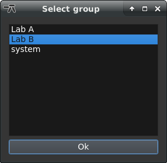
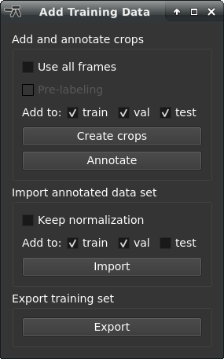
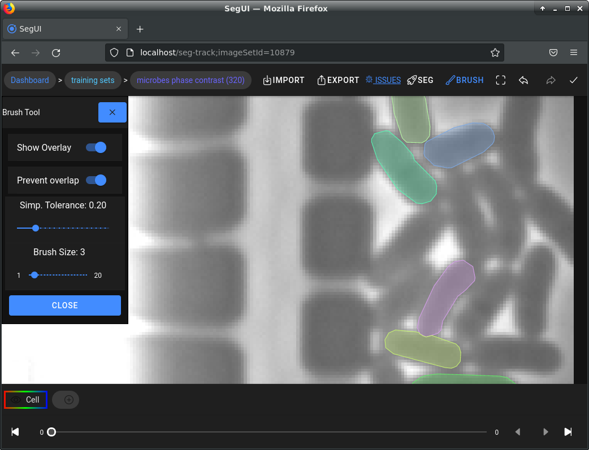

# 

microbeSEG is a deep learning-based tool for instance segmentation of roundish objects in 2D and 2D+t data, e.g., microbes. The microbeSEG workflow covers training data creation (with pre-labeling) or import, model training, model evaluation, and the final segmentation of the data. OMERO is used for a comprehensive data management. For training data annotation, the jointly developed toolkit collection ObiWan-Microbi is used.


## Prerequisites

* [Anaconda Distribution](https://www.anaconda.com/distribution/#download-section).
* For GPU use: a CUDA capable GPU (highly recommended for training).
* Access to an [OMERO](https://www.openmicroscopy.org/omero/) server. For testing purposes a [free demo account](http://qa.openmicroscopy.org.uk/registry/demo_account/) can be requested.
* ObiWan-Microbi: after installing [ObiWan-Microbi](https://github.com/hip-satomi/ObiWan-Microbi), an OMERO server is available at the default ports.

## Installation

Clone the repository and set up a virtual environment:
```
git clone https://github.com/hip-satomi/microbeSEG.git
cd microbeSEG
conda env create -f requirements.yml
conda activate microbe_seg_ve
```
Change the OMERO host, the OMERO port and the ObiWan-Microbi annotation tool url in *settings.json* if necessary.

If you have rgb images and you do not want to process the color channels separately, use the rgb branch:
```
git switch -c rgb origin/rgb
```

## Getting Started with microbeSEG

### Start microbeSEG
Run the file microbe_seg.py:
```
python microbe_seg.py
```

The graphical user interface and the login menu open.

### Login
You need your OMERO username, host address and port for connecting to your OMERO server. Filling this information in the file *settings.json* prefills the corresponding fields.


### File & Training Set Selection
On the top left, available files and training sets can be viewed and selected. By default, only projects, datasets, files, and training sets of your default OMERO group are shown (see below how to change the group). When projects are selected, only datasets and files within these projects are shown. When datasets are selected, only files within these datasets are shown. In the training set menu, available training sets can be selected and new datasets can be created (note: only training sets for which the user has write access are shown):


For adding a new training set, the training data crop size needs to be selected. Selecting the crop size depends on the cell size and cell density in the images. We usually use 256px-by-256px or 320px-by-320px crops and prefer annotating more crops than using larger crops. However, the crop size should be selected that large that multiple (densely packed) cells could fit into the crop. 

### Settings
In the settings area, the image channel to process or extract training data crops from needs to be selected. In addition, it is possible to select the device (default: GPU if available). If no GPU is available, the corresponding radio button is disabled. micobeSEG also supports the use of multiple GPUs which allows to use larger batch sizes compared to using a single GPU (multiple GPUs only for training).

Your OMERO account may be assigned to different groups, e.g., when you are in multiple working groups/labs/... . To change the group, you can open the group selection menu with the corresponding button:



You can only see groups you are a member of. You can only see and select projects, datasets, files, and training sets of the selected group.

### Training Data Creation and Annotation
For creating new training data crops, files and a training set need to be selected. Open the training data menu with the corresponding button:



Per default, only a maximum of 40% of the frames of an experiment and maximum 30 frames per experiment are used for the crop creation. The idea is to use no subsequent frames and create more crops from different experiments. However, for some cases, e.g. when only one experiment is available, it may make sense to extract crops from all frames. Therefore, the corresponding checkbox can be checked. 

The pre-labeling option is only available if some trained models are available (see section below). Users can specify to which subset selected crops can be assigned (only relevant for experts, just keep the default if you do not know what that means). The crop creation is interactive and crops from different image areas (of the same frame) are proposed:


Crops can be selected by clicking on the corresponding image or using shortcuts (1: first image, 2: second image, 3: third image, space: select/next).

After the crop creation, the annotation tool can be opened and the crops can be annotated:



Recommendation: Select a brush size as thick as your cells are if possible. Then, you can save some time. An annotation tutorial is available [here](https://www.youtube.com/watch?v=1UMy6wnDnAU).


### Training Data Import and Export
Annotated training data can be imported using the *Import* button. Thereby, it can be specified if the images will be min-max normalized or keep their normalization and to which training data subset they are added (train, val, test). Then, the training data will be cropped and uploaded to OMERO into the selected training set.

Note: images need to begin with "img", e.g., "img001.tif" and the corresponding ground truth masks with "mask", e.g., "mask001.tif". The file formats '.png', '.tiff', '.tif', '.jpeg' are supported. 2D+t images need to be saved as single frames to be able to be imported. An easy way to get the files into the required format is to open them in [Fiji](https://imagej.net/software/fiji/) (sequences with "Import" -> "Image Sequence...") and save them as "Image Sequence..." (with Name=img for images and Name=mask for segmentation masks).   

The selected training set can be exported from OMERO using the *Export* button. Not annotated images will be skipped. The exported training data are saved into the *training_dataset* folder.

### Training
In the training menu, the batch size, how many models should be trained, the optimizer and the method can be selected:


The maximum possible batch size depends on the available RAM/VRAM. Large batch sizes can reduce the training time. Small batch sizes result in less memory demand. *Adam* is always a good choice as optimizer, but we made good experiences with the *Ranger* optimizer. Best train some models with each optimizer. The *boundary* method serves as a simple baseline method. The default *distance* method outperforms the *boundary* methods for many cell types. After starting the training process, the training data are downloaded from OMERO, the boundary or distance labels are created and the training begins:


When the model does not improve for a certain time or the maximum number of epochs (depends on the amount of available training samples and the crop size) is reached, the training finishes. The models are saved into the *models* folder. The used training set for each model is also saved there (for reproducibility and documentation since the OMERO training set may change over time, e.g., new crops are added).

### Evaluation
Trained models can be evaluated on the test set of the selected training set (metric: aggregated Jaccard index AJI+):


Models trained on the selected training set are preselected. However, models trained on other training data may work as well. For *distance* models, the cell size is adjusted automatically by testing some thresholds. There is also the possibility to save the raw convolutional neural network outputs in addition to the instance segmentation masks. Evaluation results are saved into the *evaluation* folder. When the test set changes, i.e., images have been added to or removed from the test set, the scores of former evaluated models will be removed from the test set scores csv file. This is needed since the best AJI+ model needs to be selected on the same test set. For reproducibility (the test set on OMERO may change over time), the test set is zipped and saved to each model result. The evaluation scores can also be viewed in microbeSEG (see next section).

### Inference
In the inference menu, the model for inference can be selected:

 

Available evaluation AJI+ scores are shown if available (mean and standard deviation over the test images). The best model is pre-selected. Results can either be saved locally or can be uploaded to OMERO. The overwrite checkbox needs to be checked to overwrite results. The used inference model and the inference date are attached as key value pairs to the processed files on OMERO.

Note: *overwrite* will remove all polygon ROIs attached to a file on OMERO. The OMERO.web client needs to be used to view the results (ROIs) correctly:


The annotation tool can be opened with the *correct* button to correct segmentation errors manually, e.g., wrong splits or false positives. After inference (and corrections), simple analysis results can be produced: cell counts, mean cell area in px², total cell area in px², mean major axis length in px and mean minor axis length in px for each frame. The analysis results are attached as csv file to the corresponding image on OMERO. The images, segmentation masks (each cell in a frame has a unique id), cell outlines, cell outlines - image overlays and the analysis results can be downloaded with the *export* button. The analysis results can easily be opened and plotted in Fiji:


### Pre-labeling
When trained models are available, pre-labeling can be applied in the training data crop creation:


The model selection works similar to the inference model selection. Now, a segmentation overlay can be shown (shortcut: "s"):


In cases where the segmentation is good but not error-free, the segmentation can be uploaded to OMERO as well. Then the segmentation errors can be corrected manually using the annotation tool.

Note: only manually corrected crops are used for training, i.e., the pre-label masks need to be imported and exported in the annotation tool ObiWan-Microbi. This prohibits to use erroneous, not yet corrected crops in the training process.

### Stop Calculations
Training, evaluation, inference, data imports and data exports can be stopped by pressing *Control+C* in the corresponding menus. The stopping may need some time.

### Help
Press F1 to open a short help.

## Scripts for Using microbeSEG without Graphical User Interface
The scripts *train_script.py*, *infer_script.py*, and *infer_script_local.py* allow using microbeSEG without the graphical user interface. One inference script is for the use with OMERO (project/dataset/file ids need to be stated), the other script is for processing local .tif files (may need adaptation to your image shape).

## OMERO
- OMERO clients overview: [https://docs.openmicroscopy.org/omero/5.6.1/users/clients-overview.html](https://docs.openmicroscopy.org/omero/5.6.1/users/clients-overview.html)
- Importing data with OMERO.insight: [https://downloads.openmicroscopy.org/help/pdfs/importing-data-5.pdf](https://downloads.openmicroscopy.org/help/pdfs/importing-data-5.pdf)
- We recommend using the OMERO.web client for viewing the data and results (the OMERO.insight clients does not show ROI planes correctly)

## Acknowledgments
* [https://github.com/vqdang/hover_net](https://github.com/vqdang/hover_net) (aggregated Jaccard index implementation)
* [https://github.com/lessw2020/Ranger-Deep-Learning-Optimizer](https://github.com/lessw2020/Ranger-Deep-Learning-Optimizer) (Ranger optimizer)
* [https://git.scc.kit.edu/KIT-Sch-GE/2021_segmentation](https://git.scc.kit.edu/KIT-Sch-GE/2021_segmentation) (segmentation method)

## microbeSEG Dataset
A segmentation dataset with *E. coli* and *B. subtilis* training data is available at https://doi.org/10.5281/zenodo.6497715.

## Available microbeSEG Models
Models trained on a dataset consisting of 826 320x320 px crops extracted from the Omnipose dataset (bact_fluor train, bact_phase train), the microbeSEG dataset, and the Cell Tracking Challenge datasets BF-C2DL-HSC, BF-C2DL-MuSC, Fluo-N2DL-HeLa, and PhC-C2DL-PSC are available at https://doi.org/10.5281/zenodo.6497715. The training dataset is also provided. Just download all files into the directory *models/published* in the microbeSEG repository. The models can then be selected in the graphical user interface of microbeSEG.

When using these models, please cite (and check if pre-prints have meanwhile been published in a journal/conference):
* [microbeSEG](https://doi.org/10.1101/2022.04.29.489998),
* [our method](https://doi.org/10.1371/journal.pone.0243219),
* [Omnipose](https://doi.org/10.1101/2021.11.03.467199),
* the latest Cell Tracking Challenge publication: [current paper](https://doi.org/10.1038/nmeth.4473).

## Publications
T. Scherr et al. (2022): microbeSEG: A deep learning software tool with OMERO data management for efficient and accurate cell segmentation. PLoS ONE 17(11): e0277601, [doi:10.1371/journal.pone.0277601](https://doi.org/10.1371/journal.pone.0277601). 

J. Seiffarth et al. (2022): ObiWan-Microbi: OMERO-based integrated workflow for annotating microbes in the cloud, bioRxiv, [doi:10.1101/2022.08.01.502297](https://doi.org/10.1101/2022.08.01.502297).

## See Also
[BeadNet v2](https://github.com/TimScherr/BeadNet-v2): Deep learning-based particle and spot detection in microscopy images with OMERO data management.

## License
This project is licensed under the MIT License - see the [LICENSE.md](LICENSE.md) file for details.
